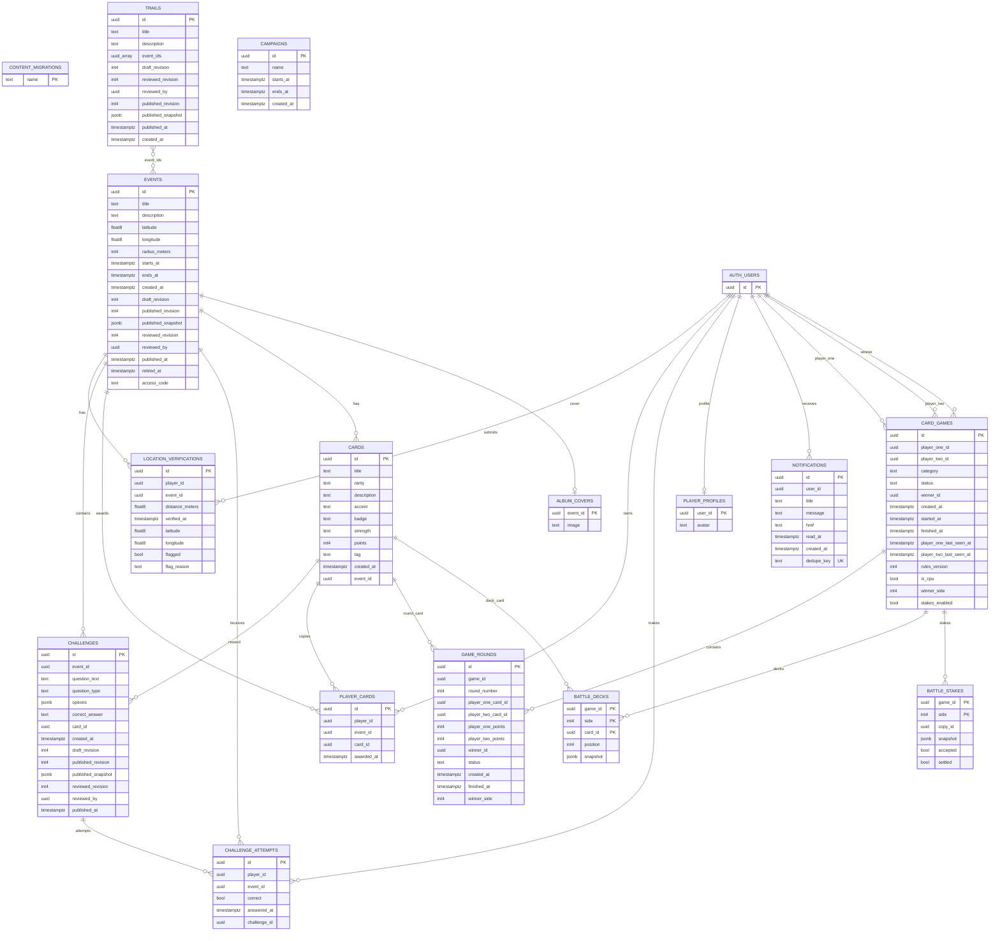

# Database schema and design rationale

## Scope and architecture

The checked-in database definition consists of **15 application tables and two views** in `public`, plus the Supabase-managed `auth.users` identity table. This reference describes `schema.sql` together with the content, trail, battle, stake and image migrations. Existing hosted databases may differ until the corresponding migrations are applied.

The browser authenticates through Supabase Auth and sends its token to Express. Application data is read and changed through parameterized PostgreSQL queries using `pg`. The database connection pool has a maximum of 10 connections, a 10-second connection timeout and a 15-second statement timeout. Multi-step operations use a shared transaction client with commit or rollback.

Deployment configuration and migration order are documented in [Deployment](deployment.md). Endpoint contracts remain in the [API reference](../handwritten-api.md).

## Column reference

`PK` means primary key; `FK` means foreign key. Primary-key columns are implicitly non-null. Other columns are nullable unless marked `NOT NULL`. A default does not prevent an explicit null. Foreign keys use PostgreSQL's default `NO ACTION` deletion behaviour unless `ON DELETE CASCADE` is shown. Unspecified defaults are absent.

### `events`

Campus quests, their location boundaries and availability windows.

Source: `backend/sql/schema.sql`, `backend/sql/content-publication.sql`.

| Column | Type | Constraints and default |
|---|---|---|
| `id` | `uuid` | `PRIMARY KEY DEFAULT gen_random_uuid()` |
| `title` | `text` | `NOT NULL` |
| `description` | `text` | Nullable; no default. |
| `latitude` | `double precision` | `NOT NULL CHECK (latitude BETWEEN -90 AND 90)` |
| `longitude` | `double precision` | `NOT NULL CHECK (longitude BETWEEN -180 AND 180)` |
| `radius_meters` | `integer` | `NOT NULL CHECK (radius_meters > 0)` |
| `access_code` | `text` | Nullable; no default. |
| `starts_at` | `timestamptz` | `NOT NULL` |
| `ends_at` | `timestamptz` | `NOT NULL` |
| `created_at` | `timestamptz` | `DEFAULT now()` |
| `draft_revision` | `integer` | `NOT NULL DEFAULT 1` |
| `published_revision` | `integer` | Nullable; no default. |
| `published_snapshot` | `jsonb` | Nullable; no default. |
| `reviewed_revision` | `integer` | Nullable; no default. |
| `reviewed_by` | `uuid` | Nullable; no default. |
| `published_at` | `timestamptz` | Nullable; no default. |

Table constraints: `CHECK (ends_at > starts_at)`.

`reviewed_by` records an administrator UUID without an Auth foreign key. Publication revisions and snapshots are coordinated by the API; their consistency is not enforced by SQL check constraints.

### `cards`

Card definitions shared by all owned copies.

Source: `backend/sql/schema.sql`.

| Column | Type | Constraints and default |
|---|---|---|
| `id` | `uuid` | `PRIMARY KEY DEFAULT gen_random_uuid()` |
| `event_id` | `uuid` | `REFERENCES public.events(id)` |
| `title` | `text` | `NOT NULL` |
| `rarity` | `text` | `NOT NULL CHECK (rarity IN ('Blue','Black','Gold'))` |
| `description` | `text` | Nullable; no default. |
| `accent` | `text` | Nullable; no default. |
| `badge` | `text` | Nullable; no default. |
| `strength` | `text` | Nullable; no default. |
| `points` | `integer` | `NOT NULL CHECK (points >= 0)` |
| `tag` | `text` | Nullable; no default. |
| `created_at` | `timestamptz` | `DEFAULT now()` |

`card-battles.sql` also adds `cards_battle_points_range`: `CHECK (points BETWEEN 0 AND 100) NOT VALID`. New inserts and updates must satisfy the range; older rows are not retrospectively validated by this migration.

### `challenges`

Questions and their reward-card references.

Source: `backend/sql/schema.sql`, `backend/sql/content-publication.sql`.

| Column | Type | Constraints and default |
|---|---|---|
| `id` | `uuid` | `PRIMARY KEY DEFAULT gen_random_uuid()` |
| `event_id` | `uuid` | `NOT NULL REFERENCES public.events(id)` |
| `question_text` | `text` | `NOT NULL` |
| `question_type` | `text` | `NOT NULL CHECK (question_type IN ('text','true_false','multiple_choice'))` |
| `options` | `jsonb` | Nullable; no default. |
| `correct_answer` | `text` | `NOT NULL` |
| `card_id` | `uuid` | `REFERENCES public.cards(id)` |
| `created_at` | `timestamptz` | `DEFAULT now()` |
| `draft_revision` | `integer` | `NOT NULL DEFAULT 1` |
| `published_revision` | `integer` | Nullable; no default. |
| `published_snapshot` | `jsonb` | Nullable; no default. |
| `reviewed_revision` | `integer` | Nullable; no default. |
| `reviewed_by` | `uuid` | Nullable; no default. |
| `published_at` | `timestamptz` | Nullable; no default. |

`reviewed_by` records an administrator UUID without an Auth foreign key. Publication revisions and snapshots are coordinated by the API; their consistency is not enforced by SQL check constraints.

### `location_verifications`

Player presence observations and suspicious-location flags.

Source: `backend/sql/schema.sql`.

| Column | Type | Constraints and default |
|---|---|---|
| `id` | `uuid` | `PRIMARY KEY DEFAULT gen_random_uuid()` |
| `player_id` | `uuid` | `NOT NULL REFERENCES auth.users(id)` |
| `event_id` | `uuid` | `NOT NULL REFERENCES public.events(id)` |
| `distance_meters` | `double precision` | `NOT NULL` |
| `verified_at` | `timestamptz` | `NOT NULL DEFAULT now()` |
| `latitude` | `double precision` | Nullable; no default. |
| `longitude` | `double precision` | Nullable; no default. |
| `flagged` | `boolean` | `NOT NULL DEFAULT false` |
| `flag_reason` | `text` | Nullable; no default. |

### `challenge_attempts`

One answer outcome per player and challenge.

Source: `backend/sql/schema.sql`.

| Column | Type | Constraints and default |
|---|---|---|
| `id` | `uuid` | `PRIMARY KEY DEFAULT gen_random_uuid()` |
| `player_id` | `uuid` | `NOT NULL REFERENCES auth.users(id)` |
| `event_id` | `uuid` | `NOT NULL REFERENCES public.events(id)` |
| `challenge_id` | `uuid` | `NOT NULL REFERENCES public.challenges(id)` |
| `correct` | `boolean` | `NOT NULL` |
| `answered_at` | `timestamptz` | `DEFAULT now()` |

Table constraints: `UNIQUE(player_id,challenge_id)`.

### `player_cards`

Individual collectible copies owned by players, including duplicates.

Source: `backend/sql/schema.sql`.

| Column | Type | Constraints and default |
|---|---|---|
| `id` | `uuid` | `PRIMARY KEY DEFAULT gen_random_uuid()` |
| `player_id` | `uuid` | `NOT NULL REFERENCES auth.users(id)` |
| `event_id` | `uuid` | `NOT NULL REFERENCES public.events(id)` |
| `card_id` | `uuid` | `NOT NULL REFERENCES public.cards(id)` |
| `awarded_at` | `timestamptz` | `DEFAULT now()` |

### `card_games`

Match participants, lifecycle, rule version and result.

Source: `backend/sql/schema.sql`, `backend/sql/card-battles.sql`, `backend/sql/battle-stakes.sql`.

| Column | Type | Constraints and default |
|---|---|---|
| `id` | `uuid` | `PRIMARY KEY DEFAULT gen_random_uuid()` |
| `player_one_id` | `uuid` | `NOT NULL REFERENCES auth.users(id)` |
| `player_two_id` | `uuid` | `REFERENCES auth.users(id)` |
| `category` | `text` | `NOT NULL` |
| `status` | `text` | `NOT NULL CHECK (status IN ('waiting','active','finished','cancelled'))` |
| `winner_id` | `uuid` | `REFERENCES auth.users(id)` |
| `created_at` | `timestamptz` | `DEFAULT now()` |
| `started_at` | `timestamptz` | Nullable; no default. |
| `finished_at` | `timestamptz` | Nullable; no default. |
| `player_one_last_seen_at` | `timestamptz` | Nullable; no default. |
| `player_two_last_seen_at` | `timestamptz` | Nullable; no default. |
| `rules_version` | `integer` | `NOT NULL DEFAULT 1` |
| `is_cpu` | `boolean` | `NOT NULL DEFAULT false` |
| `winner_side` | `integer` | `CHECK (winner_side IN (1,2))` |
| `stakes_enabled` | `boolean` | `NOT NULL DEFAULT false` |

Table constraints: `CHECK(player_one_id <> player_two_id)`.

### `game_rounds`

Per-round choices, scores and resolution.

Source: `backend/sql/schema.sql`, `backend/sql/card-battles.sql`.

| Column | Type | Constraints and default |
|---|---|---|
| `id` | `uuid` | `PRIMARY KEY DEFAULT gen_random_uuid()` |
| `game_id` | `uuid` | `NOT NULL REFERENCES public.card_games(id)` |
| `round_number` | `integer` | `NOT NULL CHECK (round_number > 0)` |
| `player_one_card_id` | `uuid` | `REFERENCES public.cards(id)` |
| `player_two_card_id` | `uuid` | `REFERENCES public.cards(id)` |
| `player_one_points` | `integer` | Nullable; no default. |
| `player_two_points` | `integer` | Nullable; no default. |
| `winner_id` | `uuid` | `REFERENCES auth.users(id)` |
| `status` | `text` | `NOT NULL CHECK (status IN ('waiting','ready','finished'))` |
| `created_at` | `timestamptz` | `DEFAULT now()` |
| `finished_at` | `timestamptz` | Nullable; no default. |
| `winner_side` | `integer` | `CHECK (winner_side IN (1,2))` |

Table constraints: `UNIQUE(game_id,round_number)`.

### `notifications`

Player notifications and read state.

Source: `backend/sql/schema.sql`.

| Column | Type | Constraints and default |
|---|---|---|
| `id` | `uuid` | `PRIMARY KEY DEFAULT gen_random_uuid()` |
| `user_id` | `uuid` | `NOT NULL REFERENCES auth.users(id)` |
| `title` | `text` | `NOT NULL` |
| `message` | `text` | `NOT NULL` |
| `href` | `text` | Nullable; no default. |
| `read_at` | `timestamptz` | Nullable; no default. |
| `created_at` | `timestamptz` | `NOT NULL DEFAULT now()` |

### `content_migrations`

One-time content migration markers.

Source: `backend/sql/content-publication.sql`.

| Column | Type | Constraints and default |
|---|---|---|
| `name` | `text` | `PRIMARY KEY` |

### `trails`

Ordered quest routes and their publication state.

Source: `backend/sql/trails.sql`.

| Column | Type | Constraints and default |
|---|---|---|
| `id` | `uuid` | `PRIMARY KEY DEFAULT gen_random_uuid()` |
| `title` | `text` | `NOT NULL` |
| `description` | `text` | Nullable; no default. |
| `event_ids` | `uuid[]` | `NOT NULL CHECK (cardinality(event_ids) BETWEEN 2 AND 20)` |
| `draft_revision` | `integer` | `NOT NULL DEFAULT 1` |
| `reviewed_revision` | `integer` | Nullable; no default. |
| `reviewed_by` | `uuid` | Nullable; no default. |
| `published_revision` | `integer` | Nullable; no default. |
| `published_snapshot` | `jsonb` | Nullable; no default. |
| `published_at` | `timestamptz` | Nullable; no default. |
| `created_at` | `timestamptz` | `NOT NULL DEFAULT now()` |

`reviewed_by` records an administrator UUID without an Auth foreign key. Publication revisions and snapshots are coordinated by the API; their consistency is not enforced by SQL check constraints.

`event_ids` preserves stop order. Array elements have no foreign keys; distinctness and event existence are validated by the API. Missing events can remain visible as unavailable stops rather than silently altering a published route.

### `battle_decks`

Committed card selections and frozen battle attributes for each side.

Source: `backend/sql/card-battles.sql`.

| Column | Type | Constraints and default |
|---|---|---|
| `game_id` | `uuid` | `NOT NULL REFERENCES public.card_games(id) ON DELETE CASCADE` |
| `side` | `integer` | `NOT NULL CHECK (side IN (1,2))` |
| `card_id` | `uuid` | `NOT NULL REFERENCES public.cards(id)` |
| `position` | `integer` | `NOT NULL CHECK (position BETWEEN 1 AND 5)` |
| `snapshot` | `jsonb` | `NOT NULL` |

Table constraints: `PRIMARY KEY (game_id,side,card_id)`; `UNIQUE(game_id,side,position)`.

### `battle_stakes`

The exact copy offered by each side, consent and settlement state.

Source: `backend/sql/battle-stakes.sql`.

| Column | Type | Constraints and default |
|---|---|---|
| `game_id` | `uuid` | `NOT NULL REFERENCES public.card_games(id) ON DELETE CASCADE` |
| `side` | `integer` | `NOT NULL CHECK (side IN (1,2))` |
| `copy_id` | `uuid` | `NOT NULL` |
| `snapshot` | `jsonb` | `NOT NULL` |
| `accepted` | `boolean` | `NOT NULL DEFAULT false` |
| `settled` | `boolean` | `NOT NULL DEFAULT false` |

Table constraints: `PRIMARY KEY(game_id,side)`.

`copy_id` identifies a `player_cards.id` logically but deliberately has no foreign key. The settled stake record can retain the original identity after later collection changes. The API checks ownership and reservation before play and transfers the copy transactionally.

### `player_profiles`

Optional profile images associated with Auth users.

Source: `backend/sql/profile-images.sql`.

| Column | Type | Constraints and default |
|---|---|---|
| `user_id` | `uuid` | `PRIMARY KEY REFERENCES auth.users(id) ON DELETE CASCADE` |
| `avatar` | `text` | `NOT NULL CHECK (length(avatar) <= 180000)` |

### `album_covers`

Optional collection cover images associated with events.

Source: `backend/sql/profile-images.sql`.

| Column | Type | Constraints and default |
|---|---|---|
| `event_id` | `uuid` | `PRIMARY KEY REFERENCES public.events(id) ON DELETE CASCADE` |
| `image` | `text` | `NOT NULL CHECK (length(image) <= 180000)` |

## Published-content views

| View | Definition and purpose |
|---|---|
| `live_events` | Expands each non-null event `published_snapshot` using `jsonb_populate_record(NULL::public.events, ...)`. Player-facing queries read the published version. |
| `live_challenges` | Expands each non-null challenge `published_snapshot` using the challenge row type. Grading and question retrieval use published content. |

A null snapshot means the draft has no live row. Draft edits do not alter the live snapshot until publication. Trails store a published snapshot but have no separate `live_trails` view; trail queries interpret the snapshot directly.

The `draft-publication-v1` marker in `content_migrations` makes the initial publication backfill run once. Rerunning the migration does not publish drafts created after that backfill.

## Relationships

| Parent | Child/reference | Relationship |
|---|---|---|
| `auth.users` | `location_verifications.player_id`, `challenge_attempts.player_id`, `player_cards.player_id`, `notifications.user_id` | One user to many activity or collection records. |
| `auth.users` | `card_games.player_one_id`, `player_two_id`, `winner_id`; `game_rounds.winner_id` | Participants and optional recorded winners. |
| `auth.users` | `player_profiles.user_id` | One user to zero or one profile image; cascade on deletion. |
| `events` | `cards.event_id`, `challenges.event_id`, `location_verifications.event_id`, `challenge_attempts.event_id`, `player_cards.event_id` | One quest to its cards, questions and activity. |
| `events` | `album_covers.event_id` | One quest to zero or one custom cover; cascade on deletion. |
| `cards` | `challenges.card_id`, `player_cards.card_id`, `battle_decks.card_id`, both `game_rounds` card columns | A shared definition referenced by rewards, copies and matches. |
| `challenges` | `challenge_attempts.challenge_id` | One question to many player outcomes. |
| `card_games` | `game_rounds.game_id` | One match to its rounds; no automatic cascade in the baseline. |
| `card_games` | `battle_decks.game_id`, `battle_stakes.game_id` | One match to committed decks and stakes; cascade on deletion. |
| `events` | `trails.event_ids` | Logical ordered membership; no element-level foreign key. |
| `player_cards` | `battle_stakes.copy_id` | Logical reference to a specific copy; no foreign key. |

Multiple foreign keys on a row do not by themselves prove that the referenced event, card and challenge belong together. Those cross-record rules are checked by application services.

### Entity relationship diagram

Solid relationships below represent foreign keys. The two dotted relationships represent logical references without foreign-key enforcement.

`content_migrations` is independent and has no relationships. The diagram groups player roles and card-choice roles; the column tables specify each individual foreign key.

## Indexes and uniqueness

Primary keys and unique constraints create indexes for identity lookups and duplicate prevention. The baseline additionally defines:

| Index | Columns | Purpose |
|---|---|---|
| `location_verifications_player_event_time` | `player_id, event_id, verified_at DESC` | Recent presence history for a player at an event. |
| `notifications_user_time` | `user_id, created_at DESC` | A player's newest notifications. |

`UNIQUE(player_id, challenge_id)` prevents a second persisted answer for the same player/question. `UNIQUE(game_id, round_number)` identifies one round per match number. Deck keys prevent repeated card identities and positions on the same side; the stake key allows at most one offer per side.

The legacy migration creates named unique indexes `challenge_attempts_player_question` and `game_rounds_game_number` for equivalent rules. The battle migration removes old player/card unique constraints so duplicate copies are permitted; it does not remove arbitrary standalone unique indexes from custom deployments.

## Access control and data lifecycle

The backend validates Auth tokens, determines the requesting player and applies ownership checks. Administrator access is based on UUIDs in `ADMIN_USER_IDS`, not usernames or email addresses.

`disable-data-api-access.sql` enables RLS and revokes browser-role grants for baseline application tables and known legacy RPCs. Feature migrations revoke access to their new tables/views; feature tables also enable RLS. The backend connection requires the intended privileged database role. RLS alone is not the backend authorisation mechanism when that role bypasses policies. Supabase Auth remains enabled while application data access goes through Express.

Account deletion locks the user and participating matches, rejects unresolved Card Duels and removes related activity and match data inside a transaction. Profile rows cascade from the Auth user; deck and stake rows cascade from the game. Unexpected foreign-key dependencies cause rollback. Most baseline references intentionally do not cascade, so content removal also depends on explicit API handling.

## Design motivation and trade-offs

| Decision | Motivation | Trade-off |
|---|---|---|
| PostgreSQL with Supabase Auth | Relational constraints and transactions fit quests, ownership and matches; Auth supplies stable user identities. | Hosted Auth configuration remains an external dependency. |
| UUID identifiers | Links between Auth, API resources and database records use the same identifier type. | UUID validity does not establish authorisation. |
| Separate `cards` and `player_cards` | Card definitions are shared while each awarded copy has its own identity, enabling duplicates and exact-copy stakes. | Ownership operations need transactional checks across records. |
| Per-challenge attempts | A player can answer multiple questions in one event while each question has one stored outcome. | Legacy per-event attempts need reliable question mapping. |
| `timestamptz` schedules | Event availability represents absolute instants while the UI can display local time. | Display timezone remains a frontend concern. |
| Draft revisions and JSON snapshots | Admin edits remain separate from published content; review can refer to a specific revision. | Snapshot fields are less constrained than normal relational columns. |
| Battle snapshots and rule versions | In-progress decks retain their captured attributes; older matches retain their rule version. | Snapshot storage duplicates card information. |
| Side identifiers for CPU matches | Both human and computer outcomes can be represented without an Auth user for the computer. | `winner_id` can be null while `winner_side` identifies the CPU winner. |
| Separate stake consent and settlement | Offered copies, mutual acceptance and a settlement guard have explicit persisted state. | Reservation and exact-copy transfer require service-level locking and validation. |
| Ordered trail UUID arrays | Route ordering is retained, including missing published stops. | SQL does not enforce element foreign keys or uniqueness. |
| Small images stored as text | Profile and album images use the same authenticated API without an additional storage service. | Encoded image strings increase row/response size; the schema limits each string to 180,000 characters. |
| Parameterized SQL through Express | Auth, game rules and ownership transitions share an auditable server boundary. | API validation is essential for invariants not expressed as database constraints. |

Exactly five cards with two Blue, two Black and one Gold, same-event/rarity duplicate exchange targets, stake eligibility and mutual consent are API rules. The SQL constrains identifiers, allowed values and selected uniqueness, but does not independently enforce all gameplay rules.
