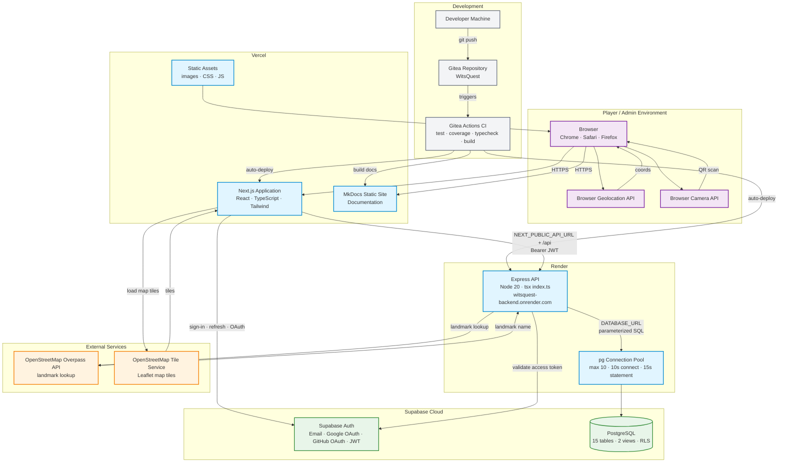

# Deployment and database setup

## Deployment architecture

The project uses separate frontend, API and database services. The platform choices are recorded in [Planning decisions](../Planning/decisions.md); this page describes the repository's deployment requirements. Hosting-dashboard settings and applied migrations are external to the repository.

| Component | Platform | Repository location | Deployment role |
|---|---|---|---|
| Player and admin application | Vercel | `frontend/` | Next.js application and public assets. |
| Handwritten API | Render | `backend/` | Express server, token validation and database operations. |
| Database and identity | Supabase | `backend/sql/` defines application schema | Hosted PostgreSQL and Supabase Auth. |
| Project documentation | Vercel, as recorded in project decisions | Repository root, `mkdocs.yml`, `docs/` | Static MkDocs output. |

The frontend sends application requests to Express and uses Supabase for sign-in/session handling. Express connects directly to PostgreSQL through `DATABASE_URL`; it does not depend on Supabase's generated application Data API. The backend address documented by the project is `https://witsquest-backend.onrender.com`.

## Application build and start configuration

| Service | Root directory | Install/build | Start/output |
|---|---|---|---|
| Frontend | `frontend` | `npm ci`, then `npm run build` | Next.js deployment output; local production start is `npm start`. |
| Backend | `backend` | `npm ci --include=dev` | `npm start` runs `tsx index.ts`. |
| Documentation | Repository root | Python dependencies from `requirements.txt`, then `python -m mkdocs build` | Static `site/` directory. |

The backend has no compiled build script. Its start command depends on `tsx`, which is currently declared in `devDependencies`; production installation therefore includes development dependencies. The server listens on the supplied `PORT`, defaulting to 5000.

CI configures Node 20. Runtime selection also depends on the engine requirements of the locked Next.js and other package versions. The frontend and backend have separate lockfiles and dependency installations.

## Environment configuration

The tracked examples are `frontend/.env.example` and `backend/.env.example`. Hosted values belong to the corresponding service environment; local backend files are loaded from `backend/.env` and then `backend/.env.local` without overriding values already present.

### Frontend

| Variable | Purpose |
|---|---|
| `NEXT_PUBLIC_API_URL` | Backend origin, without an appended `/api`; route paths supply that prefix. Defaults to `http://localhost:5000` when absent. |
| `NEXT_PUBLIC_SUPABASE_URL` | Supabase project URL for authentication. |
| `NEXT_PUBLIC_SUPABASE_ANON_KEY` | Public Supabase client key for authentication. |

These public variables are available to browser code. A frontend rebuild is required when build-time public configuration changes. A production build with the local API fallback sends requests to the player's own device rather than the hosted API.

### Backend

| Variable | Purpose |
|---|---|
| `DATABASE_URL` | Direct or session-pooler PostgreSQL connection string, with the appropriate TLS configuration and a database role authorised for backend operations. |
| `SUPABASE_URL` | Auth project URL used to validate tokens. |
| `SUPABASE_ANON_KEY` | Supabase Auth client key. |
| `ADMIN_USER_IDS` | Comma-separated `auth.users.id` UUIDs; an empty value denies administrator access. |
| `FRONTEND_URL` | Comma-separated trusted frontend origins for CORS; trailing slashes are normalised. |
| `PORT` | Listening port supplied by the host, or 5000 locally. |

Frontend and backend Auth settings refer to the same Supabase project. Database credentials remain server-side. Recreating an account can produce a different UUID, so an old administrator allowlist entry does not grant the replacement account access. Hosted configuration is independent of local `.env` files.

Authentication return URLs are part of the Supabase project's configuration: deployed sign-in and password recovery depend on the corresponding application URLs being allowed. Browser location and camera workflows also depend on a secure deployed origin and user permission.

## Database installation and migration order

SQL files are applied separately from the Node start command; application startup does not run migrations automatically. The sequence below expresses dependencies for a Supabase database, where `auth.users` already exists.

| Stage | File | Effect |
|---|---|---|
| 1, new database | `backend/sql/schema.sql` | Creates the baseline tables, checks, references and indexes. |
| 1, legacy upgrade instead | `backend/sql/migrate-existing.sql` | Maps per-event attempts to questions where unambiguous, adds uniqueness, match presence timestamps and notifications. |
| 2 | `backend/sql/content-publication.sql` | Adds draft/review/publication fields, initial backfill marker and live views. |
| 3 | `backend/sql/trails.sql` | Adds ordered trails and their publication state. |
| 4 | `backend/sql/card-battles.sql` | Adds versioned battles, deck snapshots, side results, duplicate ownership support and the new-write points range. |
| 5 | `backend/sql/battle-stakes.sql` | Adds opt-in stakes, consent and settlement records. |
| 6 | `backend/sql/profile-images.sql` | Adds player profile images and event album covers. |
| 7, after API cutover verification | `backend/sql/disable-data-api-access.sql` | Restricts direct access to baseline tables and known legacy RPCs. The Supabase Data API setting is managed separately; Auth remains enabled. |

The feature migrations precede deployment of code that queries their tables and columns. The access-restriction migration follows verification of the Express access path so that the older browser data path is not removed prematurely.

### Existing-database compatibility

`CREATE TABLE IF NOT EXISTS` is not a full schema upgrade: it leaves an existing table's columns and constraints unchanged. `migrate-existing.sql` targets the earlier documented schema and is not a universal repair for every hosted schema variant.

In particular, the baseline includes `events.access_code` and location verification `latitude`, `longitude`, `flagged` and `flag_reason` columns that the legacy migration does not add. Their presence, along with the complete [column reference](database-schema.md), is part of compatibility assessment for an older installation.

Legacy attempts are mapped automatically only when an event has exactly one challenge. An unmapped attempt aborts the migration transaction instead of assigning an arbitrary question. The points-range migration uses `NOT VALID`, preserving historical rows while constraining new writes. Old out-of-range values remain a separate data-migration concern.

Migration statements use transactions, and several changes are rerunnable through `IF NOT EXISTS` or explicit markers. This does not make every migration a reversible downgrade. Database backup and schema comparison form the recovery basis for existing-data changes.

## Verification and release behaviour

`GET /` returns the backend running message, but does not query the database. End-to-end deployment verification also covers authenticated event retrieval, administrator access, publication, card collection, battle flows and profile image persistence. These paths exercise different migrations and permissions.

A missing table or column produces PostgreSQL errors `42P01` or `42703`, which the API logs with the affected schema message. A route-level 404 can instead indicate an unmatched API path; invalid UUID validation is another distinct failure. CORS failures depend on the browser origin and backend allowlist.

The Gitea workflow runs checks for pushes and pull requests targeting `main` and `develop`. It contains test, coverage, typecheck and frontend build steps, but no hosting deployment or SQL migration step. Git mirroring and hosting auto-deploy settings control whether a pushed revision becomes a deployment; the CI workflow alone does not establish that connection. [Automated testing](../Testing/automated-testing.md) describes the checks.

Application rollback and database rollback are separate operations. A previous application revision remains usable only while the current schema is compatible with it. Transaction failure rolls back that operation; it does not undo previously completed migrations or releases.

## Platform motivation

Vercel is the project's chosen Next.js frontend host, while Render provides a separate process for the Express API. This separation matches the two package roots and their distinct build/start commands. Supabase supplies PostgreSQL and Auth together, preserving relational data and a common user identity. MkDocs produces static documentation independently of the application.

The cost of this separation is configuration across multiple services: API origins, Auth return URLs, database permissions and the deployed revisions must agree. Database-specific choices and trade-offs are detailed in [Database design rationale](database-schema.md#design-motivation-and-trade-offs).

## Deployment architecture

The Wits Quest deployment separates the frontend, backend, database, and documentation into independent hosted services. Each service has its own build pipeline and environment configuration.

**Notes:**
- The frontend sends requests to `NEXT_PUBLIC_API_URL` (e.g., `https://witsquest-backend.onrender.com`), with route paths supplying the `/api` prefix.
- The backend connects **directly** to PostgreSQL via `DATABASE_URL` — it does not use Supabase's Data API.
- Documentation is built by MkDocs and hosted on Vercel as a static site.
- Both Google and GitHub OAuth are configured on the Supabase Auth project.
- CORS is restricted to trusted origins listed in `FRONTEND_URL` on the backend.