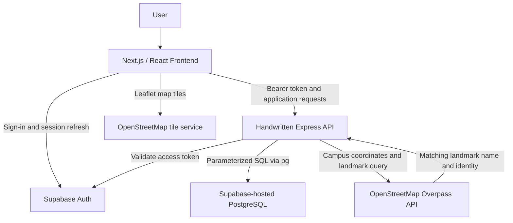
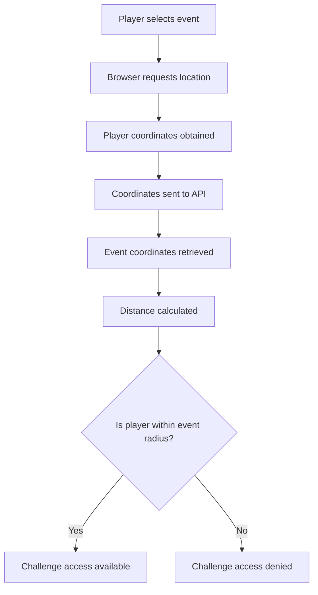
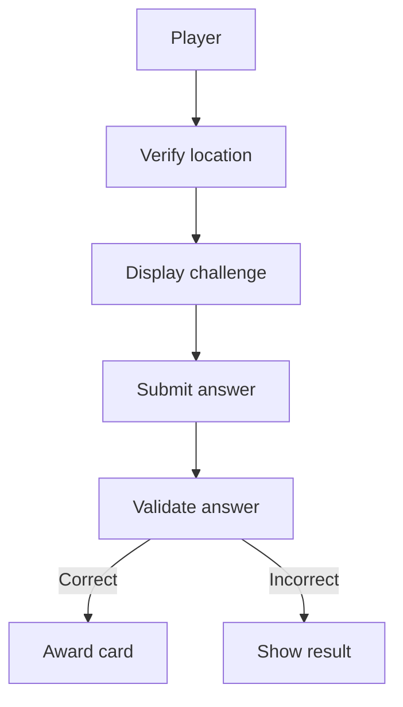
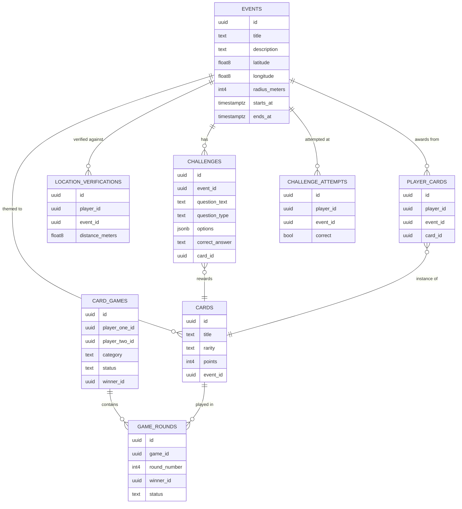
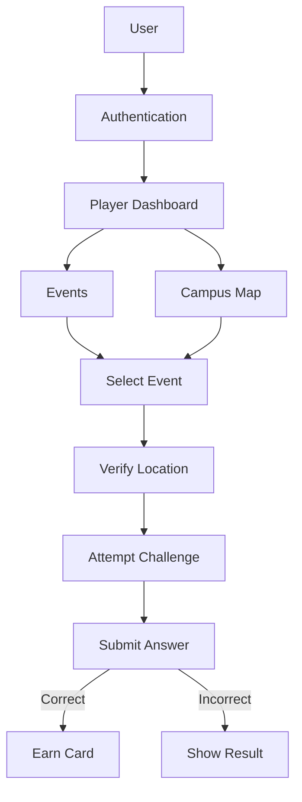

# Wits Quest – System Design

## 1. Introduction

**API migration:** Application data now goes through handwritten Express routes and direct PostgreSQL SQL. Supabase is retained for Auth and database hosting only. See [the current API contract and deployment guide](../handwritten-api.md). The RLS policies and database tables described below record the earlier deployment; the checked-in SQL and new API guide document the migration requirements.

Wits Quest is a location-based campus game designed for students at the University of the Witwatersrand. Players move around campus, discover active events, verify that they are physically within an event area, and complete challenges to earn collectible cards.

The system also provides an administrative interface where authorised administrators can create events, create challenges, manage cards, and control game content.

The application is implemented using **Next.js, React, TypeScript, Supabase, Tailwind CSS, and Leaflet**.

---

## 2. System Architecture

Wits Quest follows a layered web application architecture consisting of three main layers:

### Presentation Layer

The presentation layer contains the user interface of the application. It is implemented using **Next.js, React, TypeScript, and Tailwind CSS**.

It includes:

- Player dashboard
- Events interface
- Campus map
- Challenge interface
- Admin interface
- Profile and navigation components

### Application Logic Layer

The application logic layer uses handwritten **Express routes and TypeScript services** to handle the main rules and functionality of the game. It validates Supabase Auth access tokens and accesses PostgreSQL through parameterized SQL using `pg`.

This includes:

- Location verification
- Event status checking
- Challenge validation
- Challenge answer submission
- Authentication and access control
- Card awarding
- Campus landmark validation through the external OpenStreetMap Overpass API before event creation or updates

### Data Layer

The data layer uses **Supabase** and its PostgreSQL database.

It is responsible for storing:

- Users
- Events
- Challenges
- Cards
- Location verifications
- Player progress

The overall architecture can be represented as:



### External API integration: campus landmark validation

The admin event form sends coordinates to `POST /api/admin/landmarks/lookup` after typing pauses. Express requires an authenticated administrator, validates the numeric coordinates, and calls the Overpass API with a fixed query. It searches within 150 metres for a named building, historic feature, artwork, or museum, restricted to a mapped university or college area containing the coordinates.

The returned landmark name fills an empty event title. Administrators can also select **Use this name as the event title** to replace an existing title, then edit it. The response includes an OpenStreetMap link for attribution and inspection.

Both `POST /api/admin/events` and `PUT /api/admin/events/:id` independently require a successful lookup before writing to PostgreSQL. A caller cannot bypass this by skipping the form lookup. This means external API data directly controls whether an event can be saved, as well as supplying its suggested title. Leaflet's separate tile requests provide the visual map.

The backend caches lookup results for five minutes (up to 200 coordinate entries) and applies a 20-second request timeout. No match returns HTTP 422; an upstream failure returns HTTP 503 and prevents saving. Missing OpenStreetMap campus boundaries or landmark names may cause valid real-world locations to fail validation. Only event coordinates are sent upstream, not user tokens. The selected name can be saved as the event title; no separate landmark database field is added.

The Great Hall test coordinates `-26.1924, 28.0308` returned **Great Hall** during integration testing. Map data can change, so this is a test example rather than a guaranteed future response. Player GPS verification remains a separate process using browser coordinates and the backend's distance calculation.

See the [API reference: landmark lookup](../handwritten-api.md#post-apiadminlandmarkslookup) for request headers, response examples, and errors. Map data is provided by [OpenStreetMap contributors](https://www.openstreetmap.org/copyright).

## 3. Technologies

See the [third-party dependency and attribution register](../third-party-dependencies.md) for library versions, source links, licence metadata, selection rationales, external services, and reused assets.

| Technology | Purpose |
|---|---|
| Next.js | Main web application framework |
| React | Building reusable user interface components |
| TypeScript | Type-safe application development |
| Tailwind CSS | Styling and responsive design |
| Supabase | Authentication and database services |
| Express and pg | Handwritten application endpoints and parameterized SQL |
| OpenStreetMap Overpass API | Campus landmark lookup and validation before saving events |
| PostgreSQL | Persistent data storage |
| Leaflet | Interactive campus map |
| React Leaflet | Integration of Leaflet with React |
| Browser Geolocation API | Obtaining the player's current location |
| GitHub OAuth | User authentication |

---

## 4. Frontend Design

The frontend uses the **Next.js App Router**.

Important application routes include:

```text
/dashboard
/dashboard/events
/dashboard/admin/events
/dashboard/admin/challenges
/dashboard/admin/cards
/map
/notifications
```

### 4.1 Player Dashboard

The player dashboard acts as the main page after authentication.

It allows players to:

- Navigate through the game
- View events
- Access the campus map
- View notifications
- Access their profile
- Log out

### 4.2 Events Interface

The events interface displays events created for the game.

Each event contains information such as:

- Event title
- Description
- Latitude
- Longitude
- Allowed radius
- Start time
- End time

Players must be within the allowed event radius before they can participate in its challenge.

### 4.3 Campus Map

The campus map is implemented using **Leaflet** and **React Leaflet**.

The map displays the locations of game events using their stored latitude and longitude coordinates.

Events are represented using map markers and their associated location radius.

---

## 5. Location Verification Design

Location verification ensures that players are physically close enough to an event before attempting its challenge.

The browser uses the **Geolocation API** to obtain the player's current:

- Latitude
- Longitude
- Location accuracy

The player's location is sent to the location verification API. The backend retrieves the event's coordinates and compares them with the player's coordinates.

### Location Verification Flow



The system uses the **Haversine formula** to calculate the distance between the player and the event.

The calculated distance is compared with the event's `radius_meters`:

```text
distance <= radius_meters
```

If this condition is true, the player's location is successfully verified.

The system also checks whether the event is currently active based on its start and end times.

---

## 6. Authentication Design

Authentication is handled using **Supabase Auth**, which manages the authenticated user's session.

The application supports three sign-in methods, implemented in `lib/authService.ts`:

| Method | Implementation |
|---|---|
| Email / password | `signUp()` and `signIn()`, using Supabase's built-in `signUp` / `signInWithPassword` |
| Google OAuth | `signInWithGoogle()`, using Supabase's OAuth provider integration |
| GitHub OAuth | `signInWithGithub()`, following the same OAuth pattern |

Protected application functionality checks whether a valid authenticated user exists before allowing access.

---

## 7. Administrator Access

Administrative functionality is separated from normal player functionality.

The main administrative routes are:

```text
/dashboard/admin/events
/dashboard/admin/challenges
/dashboard/admin/cards
```

Admin pages perform an additional authorisation check. If a user does not have administrator access, they are redirected to the normal dashboard.

Administrators can manage:

- Events
- Challenges
- Cards

---

## 8. Event Management

Administrators can create, view, update, and delete events.

An event contains:

```text
Event
-------------------------
id
title
description
latitude
longitude
radius_meters
starts_at
ends_at
created_at
```

The administrator provides the event's coordinates and radius. These values are later used during player location verification.

---

## 9. Challenge Management

Each event can have one or more challenges.

Administrators manage challenges through:

```text
/dashboard/admin/challenges
```

A challenge contains information such as:

```text
Challenge
-------------------------
id
event_id
question_text
question_type
options
correct_answer
card_id
created_at
```

The `event_id` associates a challenge with an event.

The application supports three challenge question types:

- Multiple choice
- True / False
- Text answer

### Multiple Choice

Multiple-choice challenges contain a list of possible answers. The administrator must provide at least two options and specify the correct answer, which must match one of the provided options.

### True / False

True/False challenges allow the administrator to select either `True` or `False` as the correct answer.

### Text Answer

Text challenges allow players to manually enter an answer, which is compared with the expected answer stored for the challenge.

---

## 10. Challenge Submission

After a player's location has been successfully verified, the player can attempt the challenge associated with the event.

The general challenge flow is:


The player's submitted answer is compared with the challenge's stored correct answer. If the answer is correct, the player receives the associated card.

---

## 11. Card System

Cards are rewards that players can earn by successfully completing challenges.

Administrators can manage cards from:

```text
/dashboard/admin/cards
```

A card can contain information such as:

- Title
- Description
- Rarity
- Theme
- Associated challenge or event

Cards provide a reward and progression mechanism for players participating in Wits Quest.

---

## 12. Database Design

The application uses a **Supabase PostgreSQL database** consisting of eight tables covering events, challenges, cards, location verification, and the battle system.

### Events

| Name | Type | Constraints |
|------|------|-------------|
| `id` | `uuid` | Primary |
| `title` | `text` | |
| `description` | `text` | Nullable |
| `latitude` | `float8` | |
| `longitude` | `float8` | |
| `radius_meters` | `int4` | |
| `starts_at` | `timestamptz` | |
| `ends_at` | `timestamptz` | |
| `created_at` | `timestamptz` | Nullable |

### Challenges

| Name | Type | Constraints |
|------|------|-------------|
| `id` | `uuid` | Primary |
| `event_id` | `uuid` | |
| `question_text` | `text` | |
| `question_type` | `text` | |
| `options` | `jsonb` | Nullable |
| `correct_answer` | `text` | |
| `card_id` | `uuid` | Nullable |
| `created_at` | `timestamptz` | Nullable |

### Location Verifications

| Name | Type | Constraints |
|------|------|-------------|
| `id` | `uuid` | Primary |
| `player_id` | `uuid` | Nullable |
| `event_id` | `uuid` | Nullable |
| `distance_meters` | `float8` | Nullable |
| `verified_at` | `timestamptz` | Nullable |

### Cards

| Name | Type | Constraints |
|------|------|-------------|
| `id` | `uuid` | Primary |
| `title` | `text` | |
| `rarity` | `text` | |
| `description` | `text` | Nullable |
| `accent` | `text` | Nullable |
| `badge` | `text` | Nullable |
| `strength` | `text` | Nullable |
| `points` | `int4` | |
| `tag` | `text` | Nullable |
| `created_at` | `timestamptz` | Nullable |
| `event_id` | `uuid` | Nullable |

### Player Cards

| Name | Type | Constraints |
|------|------|-------------|
| `id` | `uuid` | Primary |
| `player_id` | `uuid` | |
| `event_id` | `uuid` | |
| `card_id` | `uuid` | |
| `awarded_at` | `timestamptz` | Nullable |

### Challenge Attempts

| Name | Type | Constraints |
|------|------|-------------|
| `id` | `uuid` | Primary |
| `player_id` | `uuid` | |
| `event_id` | `uuid` | |
| `correct` | `bool` | |
| `answered_at` | `timestamptz` | Nullable |

### Card Games

| Name | Type | Constraints |
|------|------|-------------|
| `id` | `uuid` | Primary |
| `player_one_id` | `uuid` | |
| `player_two_id` | `uuid` | Nullable |
| `category` | `text` | |
| `status` | `text` | |
| `winner_id` | `uuid` | Nullable |
| `created_at` | `timestamptz` | Nullable |
| `started_at` | `timestamptz` | Nullable |
| `finished_at` | `timestamptz` | Nullable |

### Game Rounds

| Name | Type | Constraints |
|------|------|-------------|
| `id` | `uuid` | Primary |
| `game_id` | `uuid` | |
| `round_number` | `int4` | |
| `player_one_card_id` | `uuid` | Nullable |
| `player_two_card_id` | `uuid` | Nullable |
| `player_one_points` | `int4` | Nullable |
| `player_two_points` | `int4` | Nullable |
| `winner_id` | `uuid` | Nullable |
| `status` | `text` | |
| `created_at` | `timestamptz` | Nullable |
| `finished_at` | `timestamptz` | Nullable |

### Database Relationships



An event can contain multiple challenges and multiple cards. Location verifications, challenge attempts, and player cards each connect a player to an event, recording the outcome of that interaction. Card games consist of multiple game rounds, each of which references the cards played by both participants.

### Row-Level Security (RLS)

All tables enforce Row-Level Security policies to ensure players can only access or modify data they are authorised to.

**Events and Challenges** — viewable by any authenticated user. Insert, update, and delete operations are restricted to administrator accounts, identified by GitHub username in the user's JWT metadata.

**Cards** — viewable by any authenticated user; create, update, and delete operations are currently permitted for any authenticated user.

**Player Cards** — players may only view and insert their own awarded cards (`player_id = auth.uid()`).

**Location Verifications** — players may only insert their own location verification records.

**Challenge Attempts** — players may only insert and view their own challenge attempts.

**Card Games** — players may create their own games, view games they are part of (or open games waiting for a second player), and join a waiting game as the second player. Both participants may update a game they are part of.

**Game Rounds** — players may view, insert, and update rounds belonging only to card games they are participating in.

This ensures that gameplay data, scores, and card ownership cannot be read or modified by unauthorised players, while event and challenge content remains editable only by administrators.

---

## 13. Component Design

The frontend uses reusable React components to reduce duplicated code.

Examples include:

```text
Sidebar
ProfileMenu
ProfileMenuContainer
LogoutButton
CampusMap
```

### Sidebar

The sidebar provides navigation between the main application pages, including links such as Dashboard, Events, and Notifications. The sidebar can also be collapsed to provide more screen space.

### Profile Menu

The profile menu displays information about the authenticated user and provides account-related functionality.

### Campus Map

The `CampusMap` component displays game events geographically using React Leaflet. It retrieves event information and displays event markers on the campus map.

---

## 14. Service and Utility Design

Reusable application logic is separated from UI components where appropriate.

Utility and service functions handle functionality such as:

- Supabase configuration
- Event retrieval
- Geographic calculations
- Location verification
- Event status calculation
- Authentication

This reduces duplicated code and keeps components focused on presentation.

---

## 15. Security Design

### Authentication

Users must authenticate before accessing protected functionality.

### Administrator Authorisation

Admin functionality performs additional checks to prevent normal players from accessing administrative pages.

### Location Validation

The player's reported location is compared with the stored event location before the challenge is made available. The application can reject location readings when the reported GPS accuracy is too poor.

### Server-Side Validation

Important game rules are validated by backend/API logic rather than relying only on frontend validation. This reduces the possibility of users bypassing game restrictions by modifying frontend behaviour.

---

## 16. Error Handling

The system provides feedback when operations fail.

Possible errors include:

- User is not authenticated
- User does not have administrator access
- Location permission is denied
- Player location cannot be determined
- GPS accuracy is insufficient
- Player is outside the event radius
- Event is inactive
- Challenge information is invalid
- Database operation fails

The application also displays confirmation messages when administrative operations are successful, for example:

```text
Challenge added successfully.
Challenge updated successfully.
Challenge deleted successfully.
```

---

## 17. Overall System Flow


---

## 18. Design Summary

Wits Quest uses a modular web application design that separates the **user interface, application logic, authentication, and database functionality**.

Next.js and React provide the frontend interface, while Supabase provides authentication and persistent database storage. Leaflet provides the interactive campus map, and the browser's Geolocation API provides player location information.

The core game flow consists of:

1. A player authenticating into the application.
2. The player discovering an event.
3. The application verifying the player's location.
4. The player attempting the event's challenge.
5. The application validating the submitted answer.
6. The player receiving a card after successfully completing the challenge.

This structure allows Wits Quest to combine location-based gameplay, campus exploration, challenges, and collectible rewards in a single web application.
