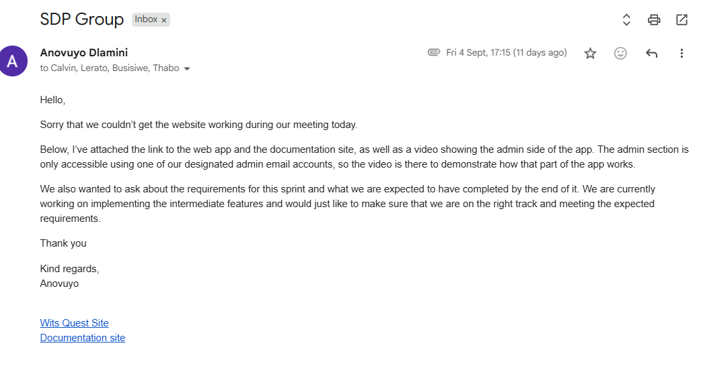

## Meeting 4 — Development and Testing Progress

**Date:** 9 September 2026

**Attendees:**

* Anovuyo Dlamini
* Busisiwe Dlamini
* Calvin Rea(Client)

### Discussion:

* The present members gave the Client feedback we received last sprint and asked for tips on how to improve next sprint.
* The meeting was held over Teams,the link is attached below:
   "https://meet.google.com/bgu-nepf-qck"
* The meeting had to be cut short after we couldn't share our screen and show the Client our current progress.
* A solution to the issue was to send a clip of the app,and ask to be advised on said clip.

